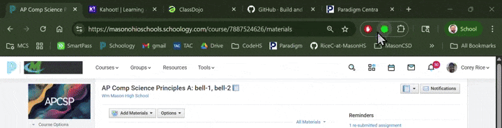

# Project: "SB29-guard-chrome" - DPA Status Checker Chrome Extension

## Mission: The "Why"
Our goal is to build a simple, privacy-first tool that empowers teachers to make safe choices about digital resources. In an instant, they should know if a website they are visiting respects student data privacy according to our district's standards (Ohio SB29).

This isn't about blocking the internet; it's about providing a gentle, informative nudge in the right direction. We're building a guardian for student data, one browser tab at a time.

## Core Principles
This project is guided by three core beliefs. Everything we build must align with these:

1. **Zero Data Collection.** We are fundamentally committed to privacy. The extension must not transmit user browsing history or any PII to any server, ever. Our architecture will reflect this. We trust our teachers, and they need to be able to trust our tool completely.

2. **Keep It Simple.** This extension has one job: display the DPA status of the current website. No feature creep. No bloat. It should be lightweight, fast, and almost invisible until it's needed.

3. **Frictionless for Teachers.** The experience should be seamless.  It needs to just work with no logins or complex setup.

## Project Status & Technical Details
This repository contains the full source code and planning documents for the extension. For a detailed breakdown of the technical architecture, feature set, and phased rollout plan, please see our [Technical Plan](requirements/technical-plan.md).